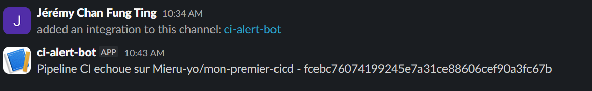

# mon-premier-cicd

[](https://github.com/Mieru-yo/mon-premier-cicd/actions/workflows/ci.yml)

## Description
Premier pipeline CI/CD avec GitHub Actions, Node.js, Jest et ESLint.

## Lancer les tests
```bash
npm ci && npm test
```

## Preuve bonus - Notification Slack

Notification recue lors d'un echec de pipeline CI :

