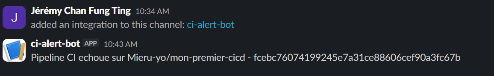

# mon-premier-cicd

[](https://github.com/Mieru-yo/mon-premier-cicd/actions/workflows/ci.yml)

## Description

Pipeline CI/CD Node.js avec qualite code, deploiement staging/production et release automatisee.

## Contribution

### Prerequis

- Node.js 18+
- npm

### Installation

```bash
npm ci
```

### Regles de qualite locales

```bash
npm run lint
npm run format:check
npm test
```

### Format des commits

Le projet suit Conventional Commits.

Exemples valides:

- feat: add divide endpoint docs
- fix: handle invalid operation in server
- chore: update github workflow cache
- refactor: simplify calculator exports

Les hooks Husky + commitlint valident le message au commit.

## Release automatique

### Strategie

- Sur push vers main, semantic-release calcule automatiquement la prochaine version SemVer.
- semantic-release cree le tag Git, met a jour CHANGELOG.md et publie la release GitHub.
- Le workflow de release sur tag v*.*.\* construit et publie l'image Docker avec:
  - le tag de version (ex: v1.0.0)
  - latest

### Secrets GitHub requis

- GITHUB_TOKEN: fourni par GitHub Actions
- GHCR token via GITHUB_TOKEN (packages: write)
- SLACK_WEBHOOK_URL pour la notif Slack (optionnel)
- SONAR_TOKEN pour SonarCloud (challenge)

### Commandes utiles

```bash
npm run release -- --dry-run
```

## Lancer les tests

```bash
npm ci && npm test
```

## Preuve bonus - Notification Slack

Notification reçue lors d'un échec de pipeline CI :



## Preuve couverture (demande TP)

La couverture est produite par le job de tests en matrix Node.js 18 et 20.

Où vérifier dans GitHub Actions :

- Ouvrir un run vert du workflow CI
- Descendre à la section Artifacts
- Vérifier la présence de coverage-node-18 et coverage-node-20

Le résumé de couverture est aussi visible dans le Summary des jobs de test.

## DevSecOps Alerts (TP8)

### Comment interpreter les alertes

- `npm audit` (job `Lint & Format`) : verifie les vulnerabilites de dependances Node.js. Le pipeline bloque sur `HIGH` et `CRITICAL`.
- `Gitleaks` (job `Gitleaks`) : detecte les secrets potentiellement commits (tokens, cles API, mots de passe).
- `Trivy` (job `Security (Trivy)`) : scanne l'image Docker. Un rapport SARIF est publie dans l'onglet Security de GitHub.
- `SonarCloud Scan` : qualite globale et quality gate.

### Procedure en cas de CVE critique

1. Identifier la source : dependance npm directe/transitive ou image Docker de base.
2. Ouvrir un ticket incident securite avec CVE, severite, composant impacte et contexte runtime.
3. Appliquer un correctif immediat : mise a jour dependance/image ou mitigation temporaire documentee.
4. Relancer la CI complete (audit + trivy + tests + sonar).
5. Si correction impossible immediatement :

- documenter un risque accepte temporairement,
- definir une date d'echeance,
- ajouter un suivi prioritaire dans le backlog securite.

6. Notifier l'equipe via Slack avec la cause, le scope et la decision (fix now / mitigation).

### Monitoring uptime

- UptimeRobot surveille l'endpoint `/health` de production.
- En cas d'alerte uptime, verifier rapidement : run de deploiement, logs Render, dernier commit merge, et alertes Sonar/Trivy.
